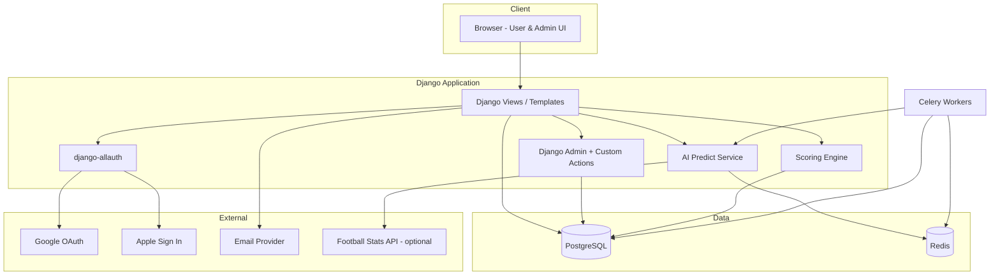
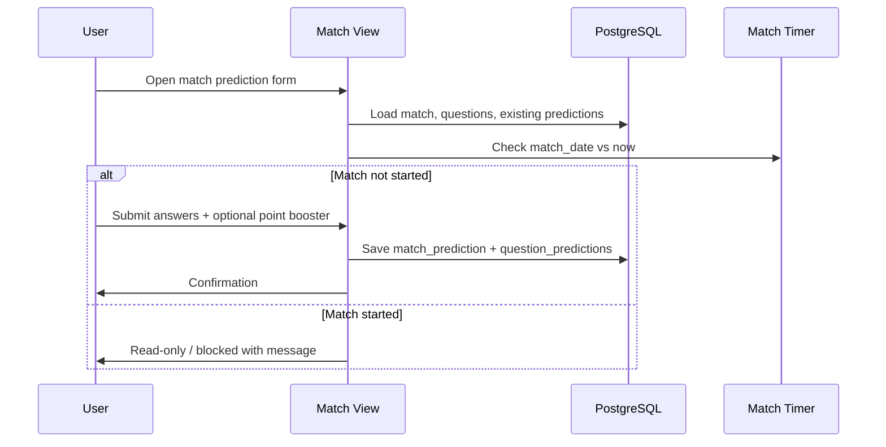
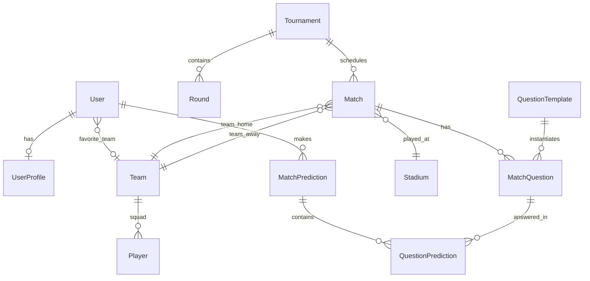

# FIFA 2026 World Cup Prediction Game — Architecture Plan

**Project:** `/Users/u1129884/Projects/PredictionGame`  
**Reference app:** `/Users/u1129884/Projects/PredictApp` (Rails)  
**Fixtures reference:** [FIFA 2026 scores & fixtures](https://www.fifa.com/en/tournaments/mens/worldcup/canadamexicousa2026/scores-fixtures?country=US&wtw-filter=ALL)

---

## Table of Contents

1. [Executive Summary](#1-executive-summary)
2. [Recommended Tech Stack (Python beginner friendly)](#2-recommended-tech-stack-python-beginner-friendly)
3. [High-Level Architecture](#3-high-level-architecture)
4. [Module Breakdown](#4-module-breakdown)
5. [Database Design](#5-database-design)
6. [API & Page Map](#6-api--page-map)
7. [Core Business Rules](#7-core-business-rules)
8. [AI Predict Design](#8-ai-predict-design)
9. [UI / Football Theme](#9-ui--football-theme)
10. [Implementation Phases](#10-implementation-phases)
11. [Production Deployment](#11-production-deployment)
12. [Email Domain Setup](#12-email-domain-setup)
13. [Data Sources for Matches & Squads](#13-data-sources-for-matches--squads)
14. [Mapping from PredictApp (Rails) to Python](#14-mapping-from-predictapp-rails-to-python)

---

## 1. Executive Summary

Build a **web-based prediction game** for FIFA World Cup 2026 with two roles:

| Role | Purpose |
|------|---------|
| **User** | Sign up/in, onboarding, predict matches before kickoff, leaderboard, graphs, profile |
| **Admin** | Manage questions, answers, user predictions, point booster defaults, tournament data |

**Recommended approach:** **Django** (Python web framework) with **PostgreSQL**, **django-allauth** (email + Google + Apple login), **Celery + Redis** (match timers, AI auto-predict jobs), and **Chart.js** (prediction graphs).

Why Django for a Python beginner:

- Built-in **Admin panel** (covers most Admin requirements out of the box)
- Built-in **User model**, password reset, email templates
- Large community, tutorials, and stable patterns
- Your existing **PredictApp** logic maps cleanly to Django models

---

## 2. Recommended Tech Stack (Python beginner friendly)

| Layer | Choice | Notes |
|-------|--------|-------|
| Language | Python 3.12+ | LTS-style version, wide library support |
| Web framework | **Django 5.x** | Admin, ORM, auth, templates |
| Auth | **django-allauth** | Email/password + Google + Apple OAuth |
| Database (dev) | SQLite | Zero setup locally |
| Database (prod) | **PostgreSQL** | Reliable, free tiers on Render/Neon |
| Cache / jobs | **Redis** + **Celery** | Countdown locks, AI predict scheduler |
| Frontend | Django templates + **Bootstrap 5** + Chart.js | Football theme; no separate SPA required for v1 |
| Static/media | WhiteNoise + S3 (optional) | Team flags, winner photos |
| Email | SendGrid / Resend / Amazon SES | See [§12](#12-email-domain-setup) |
| Fixtures data | Admin import + optional API-Football | Seed from FIFA / CSV |

### Suggested project layout

```text
PredictionGame/
├── manage.py
├── requirements.txt
├── .env.example
├── config/                 # Django settings, urls, wsgi
├── apps/
│   ├── accounts/           # User, profile, onboarding, OAuth
│   ├── tournaments/        # Tournament, rounds, teams, players, stadiums
│   ├── matches/            # Match, questions, predictions, scoring
│   ├── leaderboard/        # Rankings, team points, graphs
│   ├── admin_tools/        # Custom admin actions (optional extensions)
│   └── ai_predict/         # AI prediction service + Celery tasks
├── templates/              # Football-themed pages
├── static/                 # CSS, flags, WC images
├── media/                  # Uploaded assets
└── docs/
    └── ARCHITECTURE-PLAN.md
```

---

## 3. High-Level Architecture



### Request flow — user predicts a match



---

## 4. Module Breakdown

### 4.1 User module

| Feature | Requirement | Implementation |
|---------|-------------|----------------|
| Sign up | Name, unique display name, email, password confirm | Custom signup form extending Django User |
| Sign in | Email/password | django-allauth |
| OAuth | Google, Apple | django-allauth social providers |
| Email confirmation | Confirm before full access | allauth `ACCOUNT_EMAIL_VERIFICATION = "mandatory"` |
| First login onboarding | Favorite team + AI Predict toggle | `UserProfile.onboarding_completed` gate on dashboard |
| Dashboard | Next matches, countdown, venue | Query `Match` where `kickoff_at > now` |
| Predict | Before kickoff only | Server-side validation on `kickoff_at` |
| Match timer | Per-match countdown | JS countdown + server enforcement |
| Questions | Winner, goals, POTM, random pool | `MatchQuestion` per match (from PredictApp pattern) |
| AI Predict | Auto-fill before kickoff | Celery job if `ai_predict_enabled` |
| Point booster | Max 5 per tournament, 2× points | `MatchPrediction.point_booster_used` |
| Leaderboard | Name, matches, points, %, boosters | Aggregated view / materialized stats |
| Prediction graph | Bar/pie per question | Chart.js from aggregated answers |
| Team points | Points grouped by favorite team | Fan club leaderboard (like PredictApp `fan_club`) |
| Profile | Edit name, display name, password, team, AI toggle | Profile form + allauth password change |

### 4.2 Admin module

| Feature | Requirement | Implementation |
|---------|-------------|----------------|
| Update answers | Set correct answer per question | Django Admin on `MatchQuestion.correct_answer` |
| Update user predictions | Edit any user's answers | Admin inline / custom admin view |
| Predict for user | Admin submits on behalf of user | Reuse user predict service with `admin_override=True` |
| Point booster default | Default 5, configurable | `GameSetting.point_booster_limit` |
| Manage questions & points | CRUD question templates & weights | Admin on `QuestionTemplate` + per-match override |

Django Admin covers **1.1–1.5** with minimal custom code. Add custom admin actions for bulk scoring after answers are set.

---

## 5. Database Design

### 5.1 Entity relationship (conceptual)



### 5.2 Table definitions

#### `users` (extend Django `AbstractUser`)

| Column | Type | Notes |
|--------|------|-------|
| id | PK | |
| email | varchar, unique | Login identifier |
| password | hash | Empty for OAuth-only users |
| first_name | varchar | |
| last_name | varchar | |
| is_staff | bool | Admin access |
| is_active | bool | |
| date_joined | datetime | |

#### `user_profiles`

| Column | Type | Notes |
|--------|------|-------|
| id | PK | |
| user_id | FK → users, unique | |
| display_name | varchar, **unique** | Public leaderboard name |
| favorite_team_id | FK → teams, nullable | Set in onboarding |
| ai_predict_enabled | bool, default false | |
| onboarding_completed | bool, default false | Gates dashboard |
| point_boosters_remaining | int, default 5 | Decremented on use; admin can reset |
| email_verified_at | datetime, nullable | Mirror allauth state |

#### `social_accounts` (django-allauth)

Managed by allauth — links Google/Apple provider IDs to users.

#### `game_settings` (singleton row)

| Column | Type | Default | Notes |
|--------|------|---------|-------|
| point_booster_limit | int | 5 | Admin configurable (req 1.4) |
| ai_predict_hours_before | int | 2 | How early AI runs before kickoff |
| tournament_active_id | FK → tournaments | | Current WC 2026 |

#### `tournaments`

| Column | Type | Notes |
|--------|------|-------|
| id | PK | |
| name | varchar | e.g. "FIFA World Cup 2026" |
| location | varchar | Canada / Mexico / USA |
| start_date | date | |
| end_date | date | |
| is_active | bool | |

#### `rounds`

| Column | Type | Notes |
|--------|------|-------|
| id | PK | |
| tournament_id | FK | |
| name | varchar | GROUP-STAGE, R16, QF, SF, FINAL |
| sort_order | int | |

#### `teams`

| Column | Type | Notes |
|--------|------|-------|
| id | PK | |
| name | varchar | Argentina |
| short_name | varchar | ARG |
| fifa_code | varchar(3) | |
| flag_image | varchar / file | URL or static path |
| fifa_ranking | int, nullable | For AI predict |

#### `players`

| Column | Type | Notes |
|--------|------|-------|
| id | PK | |
| team_id | FK | |
| first_name | varchar | |
| last_name | varchar | |
| jersey_number | int | |
| position | varchar | GK, CB, LB, CDM, CM, CAM, LW, RW, ST, … |
| is_active | bool | Squad for 2026 |

#### `stadiums`

| Column | Type | Notes |
|--------|------|-------|
| id | PK | |
| name | varchar | |
| city | varchar | |
| country | varchar | |

#### `matches`

| Column | Type | Notes |
|--------|------|-------|
| id | PK | |
| tournament_id | FK | |
| round_id | FK | |
| match_number | int | |
| team_home_id | FK → teams | |
| team_away_id | FK → teams | |
| stadium_id | FK | |
| kickoff_at | timestamptz | **Lock predictions after this** |
| status | enum | scheduled, live, finished |
| home_score | int, nullable | Actual result (admin) |
| away_score | int, nullable | |
| won_in | varchar | FT, AET, PEN |

Indexes: `(kickoff_at)`, `(tournament_id, kickoff_at)`.

#### `question_templates`

Reusable question definitions (admin req 1.5).

| Column | Type | Notes |
|--------|------|-------|
| id | PK | |
| code | varchar, unique | e.g. `MATCH_WINNER` |
| question_text | text | Supports `{team_name}` placeholders |
| question_type | enum | choice, numeric, player_pick |
| default_points | int | |
| category | varchar | winner, goals, player, stats, random |
| is_active | bool | |

#### `match_questions`

Per-match instance (maps to PredictApp `match_questions`).

| Column | Type | Notes |
|--------|------|-------|
| id | PK | |
| match_id | FK | |
| question_template_id | FK | |
| question_text | text | Snapshot at creation |
| options | jsonb | `["Team A", "Team B", "Draw", …]` |
| points | int | Override template default |
| correct_answer | varchar, nullable | Admin sets after match (req 1.1) |
| sort_order | int | |

#### `match_predictions`

One row per user per match (maps to PredictApp `user_challenges` + point booster).

| Column | Type | Notes |
|--------|------|-------|
| id | PK | |
| user_id | FK | |
| match_id | FK | |
| point_booster_used | bool, default false | |
| total_points | int, default 0 | Cached after scoring |
| is_ai_generated | bool | |
| submitted_at | datetime | |
| unique | (user_id, match_id) | |

#### `question_predictions`

| Column | Type | Notes |
|--------|------|-------|
| id | PK | |
| match_prediction_id | FK | |
| match_question_id | FK | |
| user_answer | varchar | |
| points_awarded | int, nullable | Null until scored |
| unique | (match_prediction_id, match_question_id) | |

#### `past_world_cup_winners` (theme assets)

| Column | Type | Notes |
|--------|------|-------|
| year | int | 1930–2022 |
| country | varchar | |
| image_path | varchar | For login page carousel |

### 5.3 Sample question templates (from PredictApp football module)

| Code | Question | Default pts | Options |
|------|----------|-------------|---------|
| MATCH_WINNER | Who will win the match? | 8 | Home / Away / Draw |
| HOME_GOALS | Goals scored by {home_team}? | 5 | 0–10 |
| AWAY_GOALS | Goals scored by {away_team}? | 5 | 0–10 |
| PLAYER_OF_MATCH | Player of the match | 6 | Squad player list |
| FIRST_GOAL_SCORER | First goal scorer | 3 | Players + None |
| TOTAL_GOALS_1H | Total goals in 1st half | 3 | 0–6 |
| TOTAL_YELLOW_CARDS | Total yellow cards | 3 | 0–10 |
| TOTAL_CORNERS | Total corners | 3 | 0–20 |
| POSSESSION_HOME | Possession % for {home_team} | 2 | 40–60 buckets |

Admin can add/remove templates and adjust points per question (req 1.5).

### 5.4 Scoring logic

```text
For each question_prediction:
  if match_question.correct_answer is NULL → skip (not scored yet)
  if user_answer == correct_answer → points = match_question.points
  else → points = 0

If match_prediction.point_booster_used:
  total_points = sum(question points) × 2
else:
  total_points = sum(question points)
```

### 5.5 Leaderboard SQL (conceptual)

```sql
SELECT
  up.display_name,
  COUNT(DISTINCT mp.match_id) AS matches_predicted,
  COALESCE(SUM(mp.total_points), 0) AS total_points,
  ROUND(
    100.0 * COALESCE(SUM(mp.total_points), 0) /
    NULLIF(SUM(mq_sum.max_points), 0), 2
  ) AS prediction_percentage,
  COUNT(*) FILTER (WHERE mp.point_booster_used) AS boosters_used
FROM users u
JOIN user_profiles up ON up.user_id = u.id
LEFT JOIN match_predictions mp ON mp.user_id = u.id
LEFT JOIN (
  SELECT match_id, SUM(points) AS max_points
  FROM match_questions GROUP BY match_id
) mq_sum ON mq_sum.match_id = mp.match_id
GROUP BY u.id, up.display_name
ORDER BY total_points DESC;
```

### 5.6 Team points (fan club)

Aggregate `total_points` for users grouped by `favorite_team_id` — same pattern as PredictApp `fan_club` leaderboard.

---

## 6. API & Page Map

### Public / auth pages

| URL | Page |
|-----|------|
| `/` | Landing — WC 2026 hero, next 10 matches + countdown, past winners gallery |
| `/accounts/signup/` | Sign up |
| `/accounts/login/` | Sign in (email + Google + Apple buttons) |
| `/accounts/confirm-email/` | Email confirmation |
| `/accounts/password/reset/` | Forgot password |

### User pages (login required)

| URL | Page |
|-----|------|
| `/onboarding/` | Favorite team + AI Predict (first login only) |
| `/dashboard/` | Post-login — Argentina 2022 winner photo, upcoming matches |
| `/matches/` | All upcoming fixtures |
| `/matches/<id>/predict/` | Prediction form + booster checkbox |
| `/matches/<id>/squad/` | Both squads (name, number, position) |
| `/leaderboard/` | Global rankings |
| `/team-points/` | Points by favorite team |
| `/graphs/` | Prediction distribution charts |
| `/profile/` | Edit profile settings |

### Admin

| URL | Page |
|-----|------|
| `/admin/` | Django Admin — all CRUD |
| `/admin/matches/<id>/score/` | Enter correct answers + trigger scoring |
| `/admin/users/<id>/predict/<match_id>/` | Predict on behalf of user |

---

## 7. Core Business Rules

| Rule | Enforcement |
|------|-------------|
| 2.6 — No predict after kickoff | `if timezone.now() >= match.kickoff_at: reject` in view + DB check |
| 2.5 — Match timer | Frontend countdown; backend is source of truth |
| 2.9 — 5 point boosters | Decrement `point_boosters_remaining`; hide UI when 0 |
| 2.9 — Double points | Apply multiplier only to `total_points` after summing question points |
| 2.10 — Per-question points | Stored on `match_questions.points` |
| 2.8 — AI predict | Celery task runs N hours before kickoff if enabled and no prediction exists |
| Display name unique | DB unique constraint + form validation |
| Email confirmation | Block dashboard until verified (configurable) |

---

## 8. AI Predict Design

### v1 — Rule-based (no ML, beginner friendly)

Use stats available from API or seeded data:

1. **Match winner:** Compare FIFA ranking / recent form; slight home advantage.
2. **Goals:** Poisson-style estimate from average goals per team.
3. **Player questions:** Pick top scorer or captain from squad weighted by position.
4. **Stat questions (cards, corners):** Sample from team averages or tournament baseline.

```python
# Pseudocode
def ai_predict_match(user, match):
    if not user.profile.ai_predict_enabled:
        return
    if MatchPrediction.objects.filter(user=user, match=match).exists():
        return
    if timezone.now() >= match.kickoff_at:
        return

    answers = {}
    for mq in match.questions.all():
        answers[mq.id] = heuristic_answer(mq, match)

    save_prediction(user, match, answers, is_ai_generated=True)
```

### v2 — External data (optional)

- [API-Football](https://www.api-football.com/) — fixtures, stats, predictions endpoint
- [football-data.org](https://www.football-data.org/) — free tier for fixtures

Run AI job via Celery beat: every 15 minutes, find matches starting in next 2 hours where users have AI enabled and no prediction.

---

## 9. UI / Football Theme

| Screen | Visual |
|--------|--------|
| Login / landing | FIFA 2026 branding image, green pitch gradient, next 10 matches card list with flags |
| Post-login dashboard | **2022 Argentina winners** hero banner |
| Global chrome | Football icons, pitch-pattern background, team flags |
| Login sidebar | Carousel of **past World Cup winners** (1930–2022) with photos |
| Match cards | Team flag, short name, countdown timer, stadium, local kickoff time |
| Squad page | Table: #, Name, Position (color-coded by GK/DEF/MID/FWD) |

**Assets:** Use royalty-free images or FIFA press kit where license allows; store under `static/images/wc/`.

**Countdown component:** JavaScript `data-kickoff="2026-06-11T19:00:00Z"` — update every second; show "Prediction closed" when expired.

---

## 10. Implementation Phases

### Phase 1 — Foundation (week 1–2)

- Django project scaffold, PostgreSQL, User + UserProfile
- django-allauth: email signup, confirmation, password reset
- Basic football-themed login page

### Phase 2 — Tournament data (week 2–3)

- Models: Tournament, Team, Player, Stadium, Match, Round
- Admin seed/import for WC 2026 fixtures
- Login page: next 10 matches with countdown

### Phase 3 — Predictions (week 3–4)

- Question templates, match questions, prediction forms
- Kickoff lock, point booster logic
- Onboarding flow

### Phase 4 — Scoring & leaderboards (week 4–5)

- Admin answer entry, scoring engine
- Leaderboard, team points, prediction graphs

### Phase 5 — OAuth & AI (week 5–6)

- Google + Apple sign-in
- AI predict Celery jobs
- Admin: predict for user, edit predictions

### Phase 6 — Production (week 6–7)

- Deploy to Render/Railway, custom domain, email DNS
- Monitoring, backups

---

## 11. Production Deployment

### Recommended path for beginners: **Render** (free tier to start)

| Service | Render free tier | Notes |
|---------|------------------|-------|
| Web service | 750 hrs/month | Django via Gunicorn; sleeps after 15 min idle |
| PostgreSQL | 90 days free trial → paid | Or use **Neon** free Postgres permanently |
| Redis | Not free on Render | Use Upstash free Redis for Celery |

### Alternative free / low-cost hosts

| Platform | Free? | Good for | Limitations |
|----------|-------|----------|-------------|
| [Render](https://render.com) | Web + DB trial | Django, easy Git deploy | Cold starts on free web |
| [Railway](https://railway.app) | $5 credit/month | Full stack | Credit runs out |
| [Fly.io](https://fly.io) | Small free allowance | Docker deploy | More DevOps learning |
| [PythonAnywhere](https://www.pythonanywhere.com) | Beginner tier | Pure Python/Django | No custom domain on free |
| [Neon](https://neon.tech) | Free Postgres | Database only | Pair with any web host |
| [Supabase](https://supabase.com) | Free Postgres | Database + auth optional | Overkill if using Django auth |
| [Vercel](https://vercel.com) | Free frontend | Static/Next.js | **Not** ideal for Django backend |

### Production checklist

```text
1. requirements.txt pinned (Django, gunicorn, psycopg2, whitenoise, celery, redis)
2. DEBUG = False
3. ALLOWED_HOSTS = ["yourdomain.com"]
4. SECRET_KEY from environment variable
5. DATABASE_URL from Neon/Render Postgres
6. Static files: collectstatic + WhiteNoise (or S3)
7. MEDIA files: S3 or Cloudinary for team flags
8. HTTPS enforced (host provides TLS)
9. Celery worker as separate Render/Railway service
10. Database backups enabled
```

### Example `render.yaml` (starter)

```yaml
services:
  - type: web
    name: predictiongame
    env: python
    buildCommand: pip install -r requirements.txt && python manage.py collectstatic --noinput
    startCommand: gunicorn config.wsgi:application
    envVars:
      - key: DATABASE_URL
        fromDatabase:
          name: predictiongame-db
          property: connectionString
      - key: SECRET_KEY
        generateValue: true
databases:
  - name: predictiongame-db
    plan: free
```

### Custom domain

1. Buy domain (Namecheap, Google Domains, Cloudflare).
2. Add CNAME in DNS → Render/Railway hostname.
3. Enable TLS on host (automatic on Render).

---

## 12. Email Domain Setup

You need a domain (e.g. `predictiongame.com`) to send **confirmation**, **welcome**, and **password reset** emails reliably.

### Recommended providers (beginner → production)

| Provider | Free tier | Custom domain | Setup difficulty |
|----------|-----------|---------------|------------------|
| [Resend](https://resend.com) | 3,000 emails/month | Yes | Easy, modern API |
| [SendGrid](https://sendgrid.com) | 100 emails/day | Yes | Well documented |
| [Mailgun](https://mailgun.com) | 1,000 emails/month (trial) | Yes | Medium |
| [Amazon SES](https://aws.amazon.com/ses/) | ~$0.10 / 1k emails | Yes | Cheapest at scale; DNS setup |

### Step-by-step (works for SendGrid, Resend, Mailgun, SES)

#### 1. Choose sender address

Use a subdomain for transactional mail:

```text
noreply@mail.predictiongame.com
```

#### 2. Verify domain in email provider

Provider gives you DNS records to add at your registrar or Cloudflare:

| Record | Purpose | Example |
|--------|---------|---------|
| **TXT (SPF)** | Authorize provider to send | `v=spf1 include:sendgrid.net ~all` |
| **CNAME (DKIM)** | Cryptographic signature | `s1._domainkey.mail → provider target` |
| **TXT (DMARC)** | Policy for failed auth | `v=DMARC1; p=none; rua=mailto:admin@...` |

#### 3. Configure Django

```python
# settings/production.py
EMAIL_BACKEND = "django.core.mail.backends.smtp.EmailBackend"
EMAIL_HOST = "smtp.sendgrid.net"  # or smtp.resend.com
EMAIL_PORT = 587
EMAIL_USE_TLS = True
EMAIL_HOST_USER = "apikey"  # SendGrid uses literal "apikey"
EMAIL_HOST_PASSWORD = os.environ["SENDGRID_API_KEY"]
DEFAULT_FROM_EMAIL = "FIFA 2026 Predictions <noreply@mail.predictiongame.com>"
SERVER_EMAIL = DEFAULT_FROM_EMAIL

# django-allauth
ACCOUNT_EMAIL_VERIFICATION = "mandatory"
ACCOUNT_EMAIL_SUBJECT_PREFIX = "[WC2026] "
```

#### 4. Email types mapped to requirements

| Requirement | Django / allauth |
|-------------|------------------|
| 2.2 Confirmation mail | allauth email confirmation on signup |
| Password reset | `PasswordResetView` / allauth |
| Login notification (optional) | Custom signal on `user_logged_in` |

#### 5. Test before production

```bash
python manage.py shell
>>> from django.core.mail import send_mail
>>> send_mail("Test", "Body", "noreply@mail.predictiongame.com", ["you@gmail.com"])
```

Check inbox + spam folder. Use [mail-tester.com](https://www.mail-tester.com) to verify SPF/DKIM score.

### Without own domain (development only)

- **Mailtrap** — catches emails in dev (no real delivery)
- **Gmail SMTP** — not recommended for production (limits, spam)

---

## 13. Data Sources for Matches & Squads

| Source | Use | Cost |
|--------|-----|------|
| [FIFA fixtures page](https://www.fifa.com/en/tournaments/mens/worldcup/canadamexicousa2026/scores-fixtures) | Manual reference for admin seed | Free |
| API-Football | Fixtures, squads, live scores | Free tier limited |
| football-data.org | Fixtures | Free tier |
| Custom CSV import | Admin management command | Free |

**Recommendation:** Build a Django management command `load_wc2026_fixtures` that reads CSV exported from FIFA/API. Update squads when FIFA publishes final lists.

PredictApp seeded data manually via admin/RailsAdmin — same approach works here.

---

## 14. Mapping from PredictApp (Rails) to Python

| PredictApp (Rails) | PredictionGame (Django) |
|----------------------|---------------------------|
| `users` | `users` + `user_profiles` |
| `user_challenges` | `match_predictions` |
| `predictions` | `question_predictions` |
| `match_questions` | `match_questions` |
| `questions` | `question_templates` |
| `matches`, `teams`, `players`, `stadiums`, `rounds`, `tournaments` | Same names |
| `User::POINT_BOOSTER = 5` | `game_settings.point_booster_limit` |
| `point_booster` on user_challenge | `match_predictions.point_booster_used` |
| RailsAdmin `/admin` | Django Admin `/admin/` |
| Devise (email only) | django-allauth (+ Google/Apple) |
| `leaderboard` on Tournament | `leaderboard` app / view |
| `prediction_graph` | Chart.js view |
| `fan_club` | `team_points` page |
| `Football::BasicQuestions` | `question_templates` seed data |
| Not in PredictApp | `ai_predict_enabled`, `display_name`, OAuth |

---

## Next Steps

1. **Initialize Django project** in `PredictionGame/` with apps listed in [§2](#2-recommended-tech-stack-python-beginner-friendly).
2. **Create models** from [§5](#5-database-design) using Django migrations.
3. **Seed question templates** from PredictApp `Football::BasicQuestions`.
4. **Build auth + onboarding** before prediction UI.
5. **Import WC 2026 fixtures** when squad data is available.

If you want, the next session can scaffold the Django project structure and first migrations from this plan.
